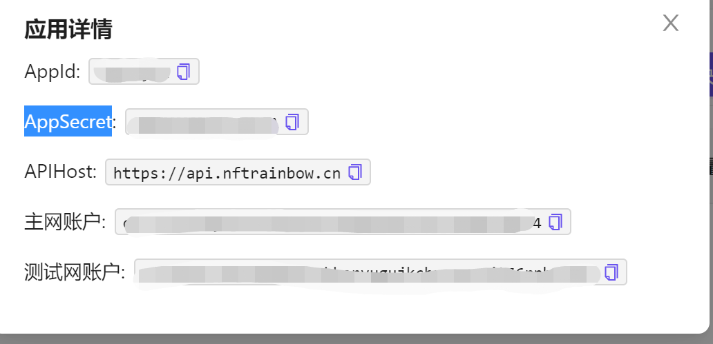

# rainbow-java-sdk-examples
该教程提供了从部署合约开始到铸造及转移NFT的流程，能够帮助开发者快速上手Rainbow-SDK，在短时间内实现自己的NFT的发行。

## 前置准备
1. 注册账号
    - 访问[NFTRainbow控制台](https://console.nftrainbow.cn/)，注册账户.
    - 进入后，需要去完善用户信息。通过控制台右上角的用户设置，进行用户信息的完善。
    
    - 当KYC通过后，就完成了账户的注册
2. 创建Application
    - 点击创建项目后输入信息完成创建，接着再查看信息

    - 点击查看AppKey，得到`AppId`和`AppSecret`
   
3. 在得到这两个参数后，就完成了前置准备工作。这两个参数将用于open-api的Login接口获取jwt


## 安装依赖
### Maven users
将以下依赖加入项目的POM中
````
<dependency>
  <groupId>org.openapitools</groupId>
  <artifactId>rainbow-apache-httpclient</artifactId>
  <version>1.0</version>
  <scope>compile</scope>
</dependency>
````

### Gradle users
将以下依赖加入项目的build文件中
````
compile "org.openapitools:rainbow-apache-httpclient:1.0"
````

## FAQs
1. 通过rainbow在主网部署的合约，为何不能调用setSponsor接口？
    - setSponsor接口只能用于测试网，主网目前不支持。若需要赞助，请联系项目方

2. 还有其他的API的教程么？
   - 该教程例子只包括了从合约部署到mint再到transfer NFT的流程，后续其他的例子会补上。
   - 通过以上例子，对Rainbow-Java-SDK有了一定的了解后，可以查阅[接口例子](https://github.com/nft-rainbow/rainbow-sdk-java#:~:text=Documentation%20for%20API%20Endpoints)
   来获得更多的信息

3. 接口中的各个参数是什么意思？
    - 具体的参数信息可以查阅[接口文档](https://docs.nftrainbow.xyz/api-reference/open-api)

4. 如何查询NFT的mint情况？
   - 在mint后可以得到id，在等待该交易上链后(几秒到十几秒)，可以调用`getMintDetail()`来获取交易的hash
   - 在scan(主网:https://confluxscan.io/, 测试网: https://testnet.confluxscan.io/)中可以看到交易情况
   - 在该NFT的拥有者的账户中的数字藏品页面可以看到该NFT
    
    